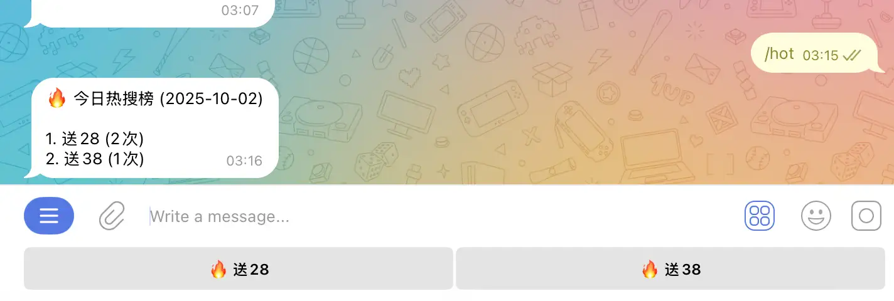

# TG白菜网项目机器人
## 机器人干什么用的？
机器人免费供用户使用，专为老哥们打造的娱乐型白菜网项目服务工具。此机器人旨在便捷地帮助老哥们查询各类白菜网、白嫖网以及彩金网的优质项目，通过整合全网资源，实现一键搜索功能，让用户无需频繁切换网站找项目，真正提升效率与便利性。
## 如何开始
1. **下载Telegram纸飞机**

使用白菜网项目的机器人需要先安装Telegram（也称为电报纸飞机）。如果不知道如何下载和安装，可以点击教程链接进行详细了解和操作。

2. **搜索机器人:[@My_BcwBot](https://t.me/My_BcwBot)**

点击下面的**`Start`**开始使用

## 搜索项目
进去机器对话框之后，直接发送你想要搜索的项目名字
例如：
- 送28
- 新葡京
- 太阳城

每个页面默认显示5个项目手动切换上下页

::: danger 注意
不要发太模糊的关键词可能会搜不到结果
:::
## 进阶搜索
可以选择排除不想搜索的项目名称，并且可以同时支持多个名称。`搜索的名称 -不想搜索的名称`

例如：

原理就是搜索了送38排除掉了带有体育的名字

## 搜索历史
机器人拥有内置的搜索历史功能，每次输入的项目名称都会被记录下来。您可以通过发送 `/history` 命令查看这些记录，这样能够方便地回顾之前的项目内容。

在对话界面左下角点击三条杠发送`命令`或直接输入`/history`

## 每天热搜
统计用户搜索词的热度排行，提供每日趋势分析。通过对话框输入 `/hot` 或点击左下角菜单发送命令即可查看结果。

## 通知订阅
### 关键词订阅通知

通过指令 例如： `/subscribe 送28` 订阅后，系统将自动监测白菜网的最新更新，并在第一时间以信息形式向您发送通知。此外，可同时订阅多个关键词，以便接收与相关内容匹配的实时更新。

::: tip 建议事项
建议订阅时关注几个核心关键词，例如“送”、“送27”、“金沙”、“体育”、“电子”等等。尤其是订阅“送”或带有数字的内容，可以获取更全面的推送信息。
:::

### 取消订阅
通过指令如 `/unsubscribe 送28` 取消订阅后，系统将不再监测该关键词，也不会发送相关通知。

### 订阅列表
输入 `/mysubscribe` 指令即可查看你的订阅列表，当前最多可订阅10个关键词。

